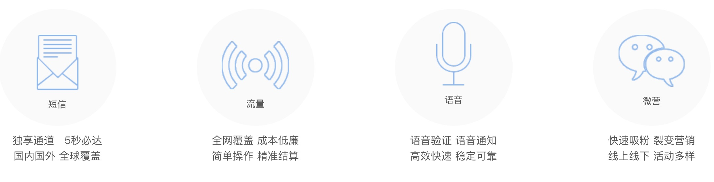
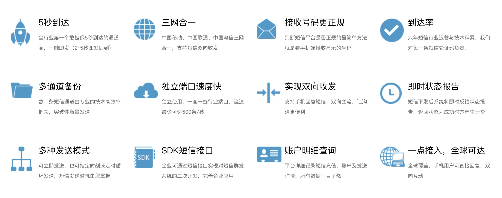
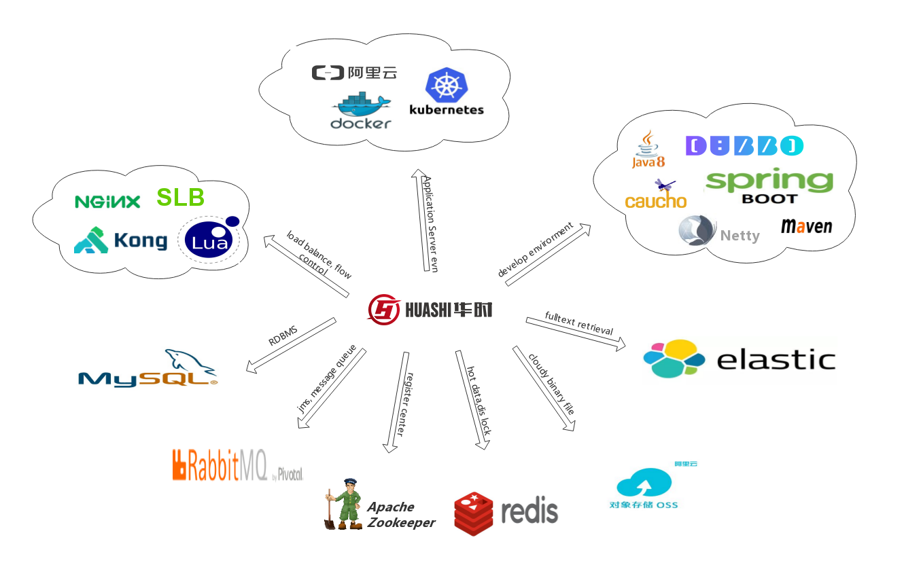
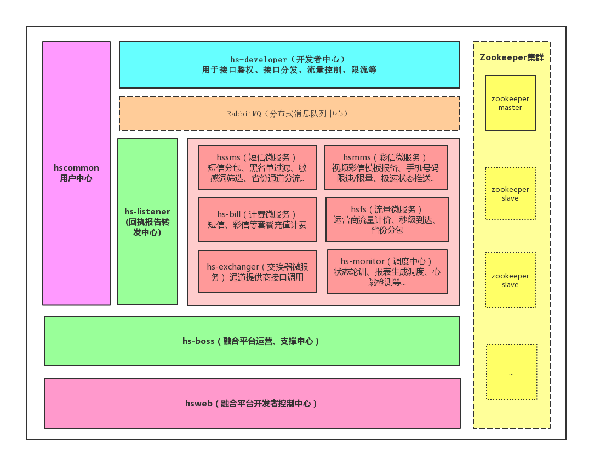

# 华时融合平台

## 业务描述

融合平台旨在构建短信、彩信、流量、语音等多业务融合一身，一次开户授权即可享用多元业务场景；我们提供完备的鉴权、计费和数据多维度分析，提提供稳定和高并发的响应标准。

我们的产品:


- **短信服务**: 验证码是商家给用户验证身份的一个凭证，通过手机短信发送验证码，是最普遍、最安全验证用户真实身份的方式。短信验证码广泛应用于用户注册、密码找回、登陆保护、身份认证、随机密码、交易确认等应用场景。          

- **彩信服务**: 彩信支持文本、图片、语音、视频等多媒体文件方式，打破了单纯文本信息阅读的枯燥，方便企业做更好的营销推广。

- **流量服务**: 华时流量平台是国内最大的第三方手机流量营销平台之一，联手中国移动、中国联通、中国电信三大运营商，全面封装流量接口，打造“技术+供应+服务”一体化的综合性平台。

###我们的优势:


## 技术架构
### 1、环境依赖


### 2、pom模块概览
hspaas项目根节点中`pom.xml`，根节点中依赖**spring-boot-starter-parent**，如下：

```xml
<!-- current version is 2.1.5.RELEASE -->
<parent>
    <groupId>org.springframework.boot</groupId>
    <artifactId>spring-boot-starter-parent</artifactId>
    <version>${lastest.verion}</version>
    <relativePath/>
</parent>

<!-- hspaas micro service modules display-->
<modules>
    <module>hsapi</module>
    <module>hsweb</module>
    <module>hs-developer</module>
    <module>hs-listener</module>
    <module>hscommon</module>
    <module>hs-bill</module>
    <module>hssms</module>
    <module>hsmms</module>
    <module>hsfs</module>
    <module>hs-exchanger</module>
    <module>hs-monitor</module>
    <module>hsboss</module>
</modules>
```
 
### 3、模块详细说明

- **hsapi **: SDK,用于**dubbo**接口、本地值域暴露，公用方法封装提供，如基础加密算法、邮箱手机号码等正则校验工具类等；
- **hsweb**: 官网及开发者控制中心，如页面发送短信、彩信等，查看发送账单等功能；
- **hs-developer**: 开发者接口调用中心，主要对接口报文参数鉴权，流量转发等功能；
- **hs-listener**: 回执报告转发中心，主要用于接受通道方处理完成后的回执对账数据，来进行后续的状态更新操作；
- **hscommon**: 用户中心，用户状态鉴权、余额管控、手机号码省份归属地服务、邮件发送服务等基础服务；
- **hs-bill**: 计费中心，短信、彩信等套餐充值计费
- **hssms**: 短信发送微服务，短信分包、黑名单过滤、敏感词筛选、省份通道分流..
- **hsmms**: 彩信发送微服务，视频彩信模板报备、手机号码限速/限量、极速状态推送..
- **hsfs**: 流量服务，运营商流量计价、秒级到达、省份分包
- **hs-exchanger**: 交换器微服务， 通道提供商接口调用
- **hs-monitor**: 任务调度中心，状态轮训、报表生成调度、心跳检测等...
- **hsboss**: 融合平台运营、支撑中心

模块依赖图 :


### 4、部署发布

基于Maven打包后，得到相应服务的**jar/war**，如 **hs-developer.jar**。

- Java 命令运行模式

`-D后面参数可以自由追加，JVM参数和GC具体参数按照当前服务器环境配置`
```bash
java -jar -XX:+UseParallelOldGC -XX:SurvivorRatio=8
    -XX:-OmitStackTraceInFastThrow
    -XX:+PrintGCDetails
    -XX:+PrintGCDateStamps
    -XX:+UseGCLogFileRotation
    -XX:NumberOfGCLogFiles=5
    -XX:GCLogFileSize=10m
    -XX:+HeapDumpOnOutOfMemoryError
    -XX:HeapDumpPath=/var/local/logs
    -Djava.io.tmpdir=/var/local/logs/tmp
    -Dspring.profiles.active=product
    -Dserver.port=8080
     hs-devoloper.jar

```
- Docker 运行模式（Dockerfile）
```bash
FROM openjdk:8-jdk-alpine
VOLUME /tmp
ARG JAR_FILE
COPY hs-developer.jar app.jar
ENTRYPOINT ["java","-Djava.security.egd=file:/dev/./urandom","-jar","/app.jar"]
```

- K8s扩展(待完善)